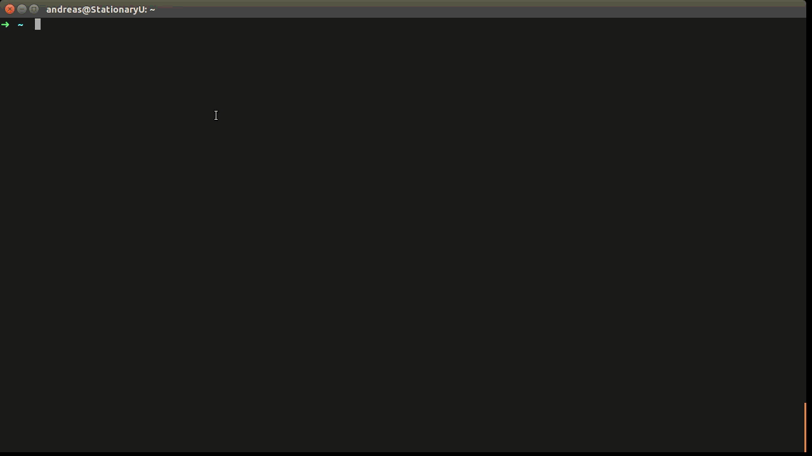
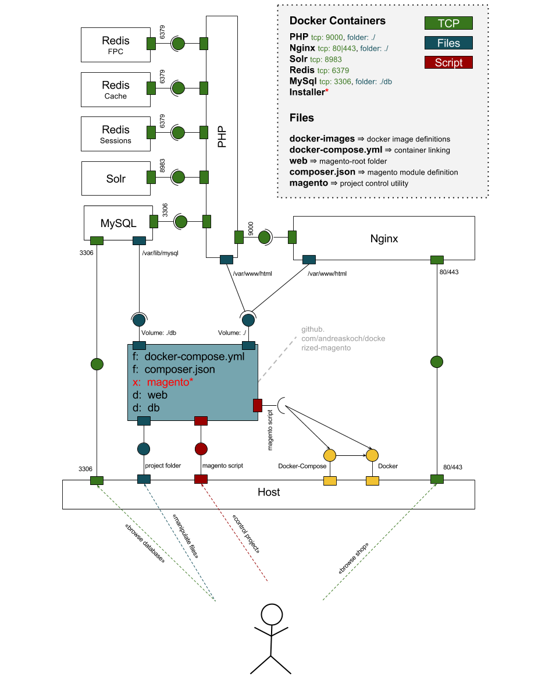

## Dockerized - Magento Community Edition 1.9.x

Uma versão com docker "Magento Community Edition 1.9.x"

### Requisitos

Linux, você deve instalar

- [docker](http://docs.docker.com/compose/install/#install-docker) 
- [docker-compose (formerly known as fig)](http://docs.docker.com/compose/install/#install-compose)


### Preparativos

O servidor da web estará vinculado às portas 80 e 443 locais. Para acessar a loja, você deve adicionar uma entrada de arquivo de hosts para `dockerized-magento.local`.

Para acessar a loja, você deve adicionar o nome de domínio "dockerized-magento.local" ao arquivo do seu host (`/ etc / hosts`).
Se você estiver usando o docker **nativo**, poderá usar este comando:

```bash
sudo su
echo "127.0.0.1    dockerized-magento.local" >> /etc/hosts
```
### Instalação

1. Certifique-se de ter docker em seu sistema
2. Clone o repositório
3. Inicie os projetos usando va na pasta raiz `docker-compose up -d`  e apos ` ./magento start`

Durante o primeiro início do projeto, o **docker-compose** será

1. primeiro **build** todas as imagens do docker referenciadas em [docker-compose.yml](docker-compose.yml)
2. então **start** os contêineres
3. e **trigger the installer**, que irá
- [install magento](docker-images/installer/bin/install.sh) e todos os módulos que são referenciados no [composer.json](composer.json) usando `composer` na pasta da web
- faça o download dos [Magento Demo Store Sample Data](http://www.magentocommerce.com/knowledge-base/entry/installing-the-sample-data-for-magento)
- copie os arquivos para o magento-root
- importe o banco de dados de amostra
- e finalmente reindexar todos os índices

Após a conclusão da instalação, o instalador imprimirá a URL e as credenciais do back-end no log do instalador:

```
...
installer_1      | phpMyAdmin: http://dockerized-magento.local:8080
installer_1      |  - Username: root
installer_1      |  - Password: pw
installer_1      |
installer_1      | Backend: http://dockerized-magento.local/admin
installer_1      |  - Username: admin
installer_1      |  - Password: password123
installer_1      |
installer_1      | Frontend: http://dockerized-magento.local/

```

[](https://s3.amazonaws.com/andreaskoch/dockerized-magento/installation/Dockerized-Magento-Installation-Linux-no-sound.mp4)

**Nota**: O processo de construção e a instalação levarão algum tempo se você iniciar o projeto pela primeira vez. Depois disso, iniciar e parar o projeto será uma questão de segundos.

### Uso

Você pode controlar o projeto usando o script `magento` integrado, que é basicamente apenas um **wrapper for docker and docker-compose** que oferece alguns **convenience features**:

`` bash
./magento <ação>
`` ``

**Actons disponíveis**

- **start**: Inicia os contêineres do docker (e aciona a instalação se o magento ainda não estiver instalado)
- **stop**: interrompe todos os contêineres do docker
- **restart**: reinicia todos os contêineres do docker e libera o cache
- **status**: imprime o status de todos os contêineres do Docker
- **stats**: exibe estatísticas de uso de recursos ao vivo de todos os contêineres
- **magerun**: Executa o magerun no diretório raiz do magento
- **composer**: executa o composer no diretório raiz do magento
- **enter**: insere o bash de um determinado tipo de contêiner (por exemplo, php, mysql, ...)
- **destroy**: interrompe todos os contêineres e remove um
todos os dados

### Componentes

#### Visão geral

O projeto Magento encaixado consiste nos seguintes componentes:

- **[docker images](docker-images)**
  
1. uma imagem [PHP](docker-images/php/Dockerfile)
 
2. uma imagem do servidor da web [Nginx](docker-images/nginx/Dockerfile)
  
3. um servidor de pesquisa [Solr](docker-images/solr/Dockerfile)
  
4. uma imagem padrão do servidor de banco de dados [MySQL](https://hub.docker.com/_/mysql/)
  
5. várias instâncias da imagem da janela de encaixe [Redis](https://hub.docker.com/_/redis/) 

6. uma imagem [phpMyAdmin](https://hub.docker.com/r/phpmyadmin/phpmyadmin/) que permite acessar o banco de dados na porta 8080
  
7. e uma imagem [Installer](docker-images/installer/Dockerfile) que contém todas as ferramentas para instalar o projeto do zero usando 
um [install script](docker-images/installer/bin/install.sh)

- um **[shell script](magento)** para controlar o projeto: [`./magento <action>`](magento)
- um [arquivo de composição](compositer.json) para gerenciar os **Magento modules**
- e o arquivo [docker-compose.yml](docker-compose.yml) que conecta todos os componentes

O diagrama de componentes deve fornecer uma idéia geral de como todos os componentes do projeto "dockerized Magento" estão conectados:

[](documentation/dockerized-magento-component-diagram.svg)

### Configuração personalizada

Todos os parâmetros da instalação do Magento são definidos por meio de variáveis ​​de ambiente definidas no arquivo [docker-compose.yml](docker-compose.yml) 

- se você deseja adaptar a instalação do Magento Shop às suas necessidades, você pode fazê-lo **modificando as variáveis ​​de ambiente** antes de iniciar o projeto.

Se você iniciou a loja antes, deve **repetir o processo de instalação** para aplicar as alterações:

1. Modifique os parâmetros no `docker-compose.yml`
2. Desligue os contêineres e remova todos os dados (`./magento destroy`)
3. Inicie os contêineres novamente (`./magento start`)

### Alterando o nome do domínio

Defino o nome de domínio padrão como `dockerized-magento.local`. Para alterar o nome do domínio, substitua `dockerized-magento.local` por` your-domain.tld` no arquivo `docker-compose.yml`:

```yaml
installer:
  environment:
    DOMAIN: dockerized-magento.local
```

### Usando um certificado SSL diferente

Por padrão, escolhi um certificado fictício ([config/ssl/cert.pem](config/ssl/cert.pem)).
Se você deseja usar um certificado diferente, basta substituir a chave e o certificado pelos seus próprios certificados.

### Adaptar parâmetros de instalação do Magento

Se você deseja instalar o Magento usando seu próprio usuário administrador ou alterar a senha, endereço de email ou nome, você pode alterar a variável de ambiente do **installer** que começa com `ADMIN_`:

- `ADMIN_USERNAME`: o nome de usuário do usuário administrador
- `ADMIN_FIRSTNAME`: o primeiro nome do usuário administrador
- `ADMIN_LASTNAME`: o sobrenome do usuário administrador
- `ADMIN_PASSWORD`: a senha do usuário administrador
- `ADMIN_EMAIL`: O endereço de e-mail do usuário administrador (**Nota**: Verifique se ele possui uma sintaxe válida. Caso contrário, o Magento não será instalado.)
- `ADMIN_FRONTNAME`: o nome da rota de back-end (por exemplo,` http: // dockerized-magento.local / admin`)

```yaml
installer:
  build: docker-images/installer
  environment:
		ADMIN_USERNAME: admin
		ADMIN_FIRSTNAME: Admin
		ADMIN_LASTNAME: Inistrator
		ADMIN_PASSWORD: password123
		ADMIN_FRONTNAME: admin
		ADMIN_EMAIL: admin@example.com
```

### Altere a senha do usuário raiz do MySQL

Eu escolhi uma senha muito fraca para o usuário root do MySQL. Você pode alterá-lo modificando as variáveis ​​de ambiente respectivas para o **mysql-container** ... e **installer** porque, caso contrário, a instalação falhará:

```yaml
installer:
  environment:
    MYSQL_PASSWORD: <your-mysql-root-user-password>
mysql:
  environment:
    MYSQL_ROOT_PASSWORD: <your-mysql-root-user-password>
```

> Codigo baseado no de Andreas Koch 